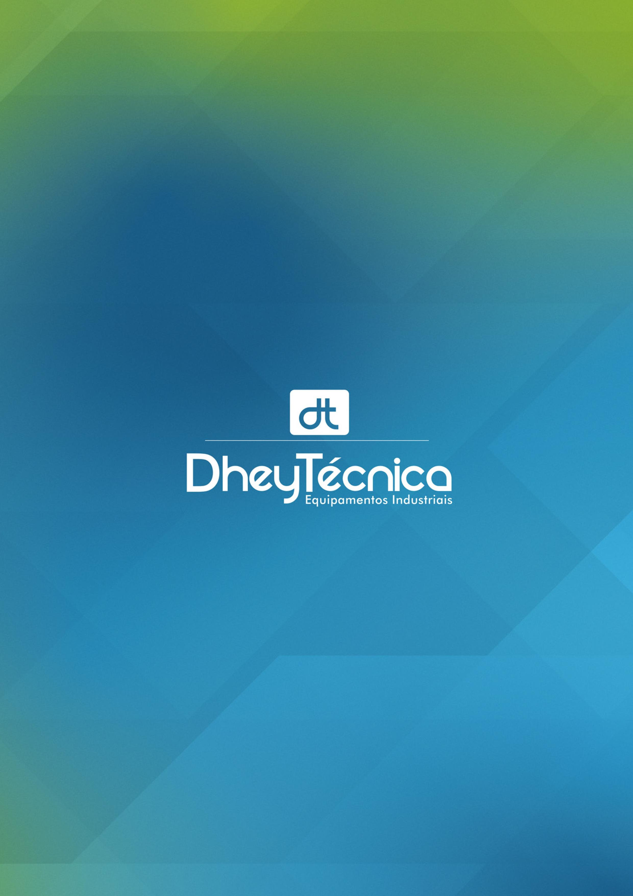

# Instruções para Implementar Zoom Funcional no Catálogo Mobile

**Autor:** Manus AI  
**Data:** 24 de junho de 2025  
**Versão:** 1.0

## Introdução

Este documento fornece instruções detalhadas para implementar uma funcionalidade de zoom robusta e responsiva no catálogo digital, especificamente otimizada para dispositivos móveis. A implementação proposta utiliza tecnologias web modernas e segue as melhores práticas de desenvolvimento frontend para garantir uma experiência de usuário fluida e intuitiva.

O zoom em dispositivos móveis apresenta desafios únicos relacionados ao gerenciamento de eventos de toque, performance de renderização e compatibilidade entre diferentes navegadores. Esta documentação aborda essas questões de forma abrangente, oferecendo soluções testadas e otimizadas.

## Análise dos Requisitos

### Funcionalidades Essenciais

A funcionalidade de zoom deve atender aos seguintes requisitos fundamentais:

**Gestos de Toque Suportados:**
- Pinch-to-zoom (beliscar para ampliar/reduzir)
- Double-tap para zoom rápido
- Pan (arrastar) para navegar na imagem ampliada
- Reset automático ou manual do zoom

**Comportamento Esperado:**
- Zoom suave e responsivo
- Limites mínimos e máximos de ampliação
- Preservação do ponto focal durante o zoom
- Transições fluidas entre estados
- Compatibilidade com navegação entre páginas

**Performance e Usabilidade:**
- Resposta imediata aos gestos
- Prevenção de conflitos com scroll da página
- Feedback visual adequado
- Acessibilidade para diferentes tamanhos de tela


## Tecnologias e Abordagens Recomendadas

### 1. CSS Transform vs Canvas vs WebGL

Para implementar zoom em aplicações web, existem três abordagens principais, cada uma com suas vantagens e desvantagens:

**CSS Transform (Recomendado)**
A abordagem CSS Transform utiliza as propriedades `transform: scale()` e `transform: translate()` para manipular elementos DOM. Esta é a abordagem mais adequada para o catálogo por várias razões:

- **Performance:** Aproveita a aceleração de hardware do navegador
- **Simplicidade:** Implementação direta com JavaScript vanilla
- **Compatibilidade:** Suporte amplo em navegadores móveis modernos
- **Manutenibilidade:** Código mais limpo e fácil de debugar
- **Acessibilidade:** Preserva a estrutura DOM para leitores de tela

**Canvas 2D**
Embora ofereça controle total sobre a renderização, o Canvas apresenta desvantagens para este caso de uso:

- Maior complexidade de implementação
- Necessidade de re-renderização constante
- Perda de acessibilidade nativa
- Maior consumo de recursos em dispositivos móveis

**WebGL**
Reservado para aplicações que exigem renderização 3D complexa ou efeitos visuais avançados, sendo excessivo para um catálogo de imagens simples.

### 2. Gerenciamento de Eventos de Toque

O gerenciamento adequado de eventos de toque é crucial para uma experiência de zoom responsiva. Os eventos principais incluem:

**Touch Events:**
- `touchstart`: Início do toque
- `touchmove`: Movimento durante o toque
- `touchend`: Fim do toque
- `touchcancel`: Cancelamento do toque

**Pointer Events (Moderno):**
- `pointerdown`: Início da interação
- `pointermove`: Movimento do ponteiro
- `pointerup`: Fim da interação
- `pointercancel`: Cancelamento da interação

A API Pointer Events é preferível por oferecer suporte unificado para mouse, toque e stylus, proporcionando maior compatibilidade e código mais limpo.

### 3. Prevenção de Comportamentos Padrão

Para implementar zoom personalizado, é essencial desabilitar comportamentos padrão do navegador:

**CSS Properties:**
```css
touch-action: none; /* Desabilita zoom nativo e scroll */
user-select: none; /* Previne seleção de texto */
-webkit-user-select: none; /* Safari */
-webkit-touch-callout: none; /* iOS callout */
```

**JavaScript Event Prevention:**
```javascript
event.preventDefault(); /* Previne ação padrão */
event.stopPropagation(); /* Para propagação do evento */
```


## Arquitetura da Solução

### Estrutura de Classes e Módulos

A implementação do zoom deve seguir uma arquitetura modular e orientada a objetos para facilitar manutenção e extensibilidade:

**ZoomManager Class:**
Classe principal responsável por coordenar todas as funcionalidades de zoom:

```javascript
class ZoomManager {
    constructor(container, options = {}) {
        this.container = container;
        this.options = {
            minZoom: 1,
            maxZoom: 4,
            zoomStep: 0.1,
            doubleTapZoom: 2,
            animationDuration: 300,
            ...options
        };
        this.state = {
            scale: 1,
            translateX: 0,
            translateY: 0,
            isZooming: false,
            isPanning: false
        };
        this.init();
    }
}
```

**GestureDetector Class:**
Responsável por detectar e interpretar gestos de toque:

```javascript
class GestureDetector {
    constructor(element, callbacks) {
        this.element = element;
        this.callbacks = callbacks;
        this.touches = new Map();
        this.lastTap = 0;
        this.bindEvents();
    }
}
```

**TransformController Class:**
Gerencia as transformações CSS e animações:

```javascript
class TransformController {
    constructor(element) {
        this.element = element;
        this.currentTransform = {
            scale: 1,
            translateX: 0,
            translateY: 0
        };
    }
}
```

### Fluxo de Dados e Estados

O sistema de zoom opera através de um fluxo de estados bem definido:

**Estados Principais:**
1. **IDLE:** Estado padrão, sem zoom ativo
2. **ZOOMING:** Zoom em progresso via pinch gesture
3. **ZOOMED:** Zoom aplicado, permitindo pan
4. **PANNING:** Navegação na imagem ampliada
5. **ANIMATING:** Transição entre estados

**Transições de Estado:**
- IDLE → ZOOMING: Detecção de pinch gesture
- ZOOMING → ZOOMED: Fim do gesture com zoom > 1
- ZOOMED → PANNING: Início de drag gesture
- PANNING → ZOOMED: Fim do drag gesture
- Qualquer estado → IDLE: Reset do zoom

### Integração com Sistema Existente

A implementação do zoom deve integrar-se harmoniosamente com o sistema de navegação existente:

**Coordenação com Navegação:**
- Desabilitar navegação entre páginas durante zoom ativo
- Reset automático do zoom ao trocar de página
- Preservar estado de zoom durante transições (opcional)

**Gerenciamento de Conflitos:**
- Priorizar gestos de zoom sobre navegação
- Implementar zonas de detecção específicas
- Fallback gracioso para dispositivos sem suporte a multi-touch


## Implementação Passo a Passo

### Passo 1: Preparação do HTML e CSS

**Estrutura HTML Atualizada:**
```html
<div class="page-viewer" id="pageViewer">
    <div class="page-content" id="pageContent">
        <div class="zoom-container" id="zoomContainer">
            
        </div>
    </div>
    
    <!-- Controles de zoom -->
    <div class="zoom-controls" id="zoomControls">
        <button class="zoom-btn zoom-in" id="zoomInBtn">+</button>
        <button class="zoom-btn zoom-out" id="zoomOutBtn">-</button>
        <button class="zoom-btn zoom-reset" id="zoomResetBtn">⌂</button>
    </div>
    
    <!-- Indicador de zoom -->
    <div class="zoom-indicator" id="zoomIndicator">100%</div>
</div>
```

**CSS Essencial:**
```css
.page-viewer {
    position: relative;
    overflow: hidden;
    touch-action: none;
    user-select: none;
    -webkit-user-select: none;
    -webkit-touch-callout: none;
}

.zoom-container {
    width: 100%;
    height: 100%;
    transform-origin: center center;
    transition: transform 0.3s cubic-bezier(0.25, 0.46, 0.45, 0.94);
    will-change: transform;
}

.zoom-container.zooming {
    transition: none;
}

.page-image {
    width: 100%;
    height: 100%;
    object-fit: cover;
    pointer-events: none;
    display: block;
}

.zoom-controls {
    position: absolute;
    bottom: 20px;
    right: 20px;
    display: flex;
    flex-direction: column;
    gap: 10px;
    opacity: 0;
    transition: opacity 0.3s ease;
    z-index: 300;
}

.zoom-controls.visible {
    opacity: 1;
}

.zoom-btn {
    width: 44px;
    height: 44px;
    border-radius: 50%;
    border: none;
    background: rgba(0, 0, 0, 0.7);
    color: white;
    font-size: 18px;
    font-weight: bold;
    cursor: pointer;
    display: flex;
    align-items: center;
    justify-content: center;
    transition: all 0.2s ease;
}

.zoom-btn:hover {
    background: rgba(0, 0, 0, 0.9);
    transform: scale(1.1);
}

.zoom-btn:active {
    transform: scale(0.95);
}

.zoom-indicator {
    position: absolute;
    top: 20px;
    left: 50%;
    transform: translateX(-50%);
    background: rgba(0, 0, 0, 0.7);
    color: white;
    padding: 8px 16px;
    border-radius: 20px;
    font-size: 14px;
    opacity: 0;
    transition: opacity 0.3s ease;
    z-index: 300;
    pointer-events: none;
}

.zoom-indicator.visible {
    opacity: 1;
}
```

### Passo 2: Implementação da Classe ZoomManager

**Código JavaScript Completo:**
```javascript
class ZoomManager {
    constructor(container, options = {}) {
        this.container = container;
        this.zoomContainer = container.querySelector('.zoom-container');
        this.image = container.querySelector('.page-image');
        this.controls = container.querySelector('.zoom-controls');
        this.indicator = container.querySelector('.zoom-indicator');
        
        this.options = {
            minZoom: 1,
            maxZoom: 4,
            zoomStep: 0.2,
            doubleTapZoom: 2,
            animationDuration: 300,
            showControls: true,
            showIndicator: true,
            ...options
        };
        
        this.state = {
            scale: 1,
            translateX: 0,
            translateY: 0,
            isZooming: false,
            isPanning: false,
            lastTouchDistance: 0,
            lastTouchCenter: { x: 0, y: 0 },
            lastTapTime: 0
        };
        
        this.init();
    }
    
    init() {
        this.bindEvents();
        this.updateControls();
        this.updateIndicator();
    }
    
    bindEvents() {
        // Pointer events para suporte universal
        this.zoomContainer.addEventListener('pointerdown', this.handlePointerDown.bind(this));
        this.zoomContainer.addEventListener('pointermove', this.handlePointerMove.bind(this));
        this.zoomContainer.addEventListener('pointerup', this.handlePointerUp.bind(this));
        this.zoomContainer.addEventListener('pointercancel', this.handlePointerCancel.bind(this));
        
        // Touch events como fallback
        this.zoomContainer.addEventListener('touchstart', this.handleTouchStart.bind(this), { passive: false });
        this.zoomContainer.addEventListener('touchmove', this.handleTouchMove.bind(this), { passive: false });
        this.zoomContainer.addEventListener('touchend', this.handleTouchEnd.bind(this), { passive: false });
        
        // Controles de zoom
        if (this.controls) {
            this.container.querySelector('.zoom-in').addEventListener('click', () => this.zoomIn());
            this.container.querySelector('.zoom-out').addEventListener('click', () => this.zoomOut());
            this.container.querySelector('.zoom-reset').addEventListener('click', () => this.reset());
        }
        
        // Prevenção de comportamentos padrão
        this.zoomContainer.addEventListener('gesturestart', e => e.preventDefault());
        this.zoomContainer.addEventListener('gesturechange', e => e.preventDefault());
        this.zoomContainer.addEventListener('gestureend', e => e.preventDefault());
    }
}
```

### Passo 3: Implementação dos Handlers de Eventos

**Detecção de Gestos Multi-touch:**
```javascript
handleTouchStart(event) {
    event.preventDefault();
    
    const touches = Array.from(event.touches);
    
    if (touches.length === 1) {
        // Single touch - possível pan ou double tap
        const touch = touches[0];
        const now = Date.now();
        
        if (now - this.state.lastTapTime < 300) {
            // Double tap detectado
            this.handleDoubleTap(touch);
        } else {
            // Início de possível pan
            this.startPan(touch);
        }
        
        this.state.lastTapTime = now;
    } else if (touches.length === 2) {
        // Multi-touch - início do zoom
        this.startZoom(touches);
    }
}

handleTouchMove(event) {
    event.preventDefault();
    
    const touches = Array.from(event.touches);
    
    if (touches.length === 1 && this.state.isPanning) {
        // Pan em progresso
        this.updatePan(touches[0]);
    } else if (touches.length === 2 && this.state.isZooming) {
        // Zoom em progresso
        this.updateZoom(touches);
    }
}

handleTouchEnd(event) {
    event.preventDefault();
    
    if (event.touches.length === 0) {
        // Todos os toques terminaram
        this.endInteraction();
    } else if (event.touches.length === 1 && this.state.isZooming) {
        // Transição de zoom para pan
        this.state.isZooming = false;
        this.startPan(event.touches[0]);
    }
}
```

**Cálculos de Transformação:**
```javascript
startZoom(touches) {
    this.state.isZooming = true;
    this.state.lastTouchDistance = this.getTouchDistance(touches[0], touches[1]);
    this.state.lastTouchCenter = this.getTouchCenter(touches[0], touches[1]);
    
    this.zoomContainer.classList.add('zooming');
    this.showControls();
}

updateZoom(touches) {
    const currentDistance = this.getTouchDistance(touches[0], touches[1]);
    const currentCenter = this.getTouchCenter(touches[0], touches[1]);
    
    if (this.state.lastTouchDistance > 0) {
        const scaleChange = currentDistance / this.state.lastTouchDistance;
        const newScale = Math.max(this.options.minZoom, 
                         Math.min(this.options.maxZoom, this.state.scale * scaleChange));
        
        // Calcular offset para manter o centro do gesto fixo
        const rect = this.zoomContainer.getBoundingClientRect();
        const centerX = currentCenter.x - rect.left;
        const centerY = currentCenter.y - rect.top;
        
        this.setZoom(newScale, centerX, centerY);
    }
    
    this.state.lastTouchDistance = currentDistance;
    this.state.lastTouchCenter = currentCenter;
}

getTouchDistance(touch1, touch2) {
    return Math.sqrt(
        Math.pow(touch2.clientX - touch1.clientX, 2) +
        Math.pow(touch2.clientY - touch1.clientY, 2)
    );
}

getTouchCenter(touch1, touch2) {
    return {
        x: (touch1.clientX + touch2.clientX) / 2,
        y: (touch1.clientY + touch2.clientY) / 2
    };
}
```


### Passo 4: Otimizações de Performance

**Throttling de Eventos:**
Para evitar sobrecarga de processamento durante gestos rápidos, implemente throttling nos handlers de movimento:

```javascript
class ZoomManager {
    constructor(container, options = {}) {
        // ... código anterior ...
        this.throttledUpdate = this.throttle(this.updateTransform.bind(this), 16); // 60fps
    }
    
    throttle(func, limit) {
        let inThrottle;
        return function() {
            const args = arguments;
            const context = this;
            if (!inThrottle) {
                func.apply(context, args);
                inThrottle = true;
                setTimeout(() => inThrottle = false, limit);
            }
        }
    }
    
    updateZoom(touches) {
        // ... cálculos de zoom ...
        this.throttledUpdate();
    }
}
```

**Otimização de Renderização:**
Utilize `will-change` e `transform3d` para ativar aceleração de hardware:

```css
.zoom-container {
    will-change: transform;
    transform: translate3d(0, 0, 0); /* Força layer de composição */
}
```

**Debouncing para Indicadores:**
Implemente debouncing para ocultar indicadores após período de inatividade:

```javascript
updateIndicator() {
    if (!this.options.showIndicator) return;
    
    const percentage = Math.round(this.state.scale * 100);
    this.indicator.textContent = `${percentage}%`;
    this.indicator.classList.add('visible');
    
    // Debounce para ocultar
    clearTimeout(this.indicatorTimeout);
    this.indicatorTimeout = setTimeout(() => {
        this.indicator.classList.remove('visible');
    }, 2000);
}
```

### Passo 5: Tratamento de Casos Extremos

**Limites de Zoom e Pan:**
Implemente verificações para manter o conteúdo dentro dos limites visíveis:

```javascript
constrainTransform() {
    const rect = this.container.getBoundingClientRect();
    const imageRect = this.zoomContainer.getBoundingClientRect();
    
    // Calcular limites baseados no zoom atual
    const scaledWidth = rect.width * this.state.scale;
    const scaledHeight = rect.height * this.state.scale;
    
    const maxTranslateX = Math.max(0, (scaledWidth - rect.width) / 2);
    const maxTranslateY = Math.max(0, (scaledHeight - rect.height) / 2);
    
    // Aplicar limites
    this.state.translateX = Math.max(-maxTranslateX, 
                            Math.min(maxTranslateX, this.state.translateX));
    this.state.translateY = Math.max(-maxTranslateY, 
                            Math.min(maxTranslateY, this.state.translateY));
}

setZoom(scale, centerX, centerY) {
    const oldScale = this.state.scale;
    this.state.scale = Math.max(this.options.minZoom, 
                       Math.min(this.options.maxZoom, scale));
    
    if (centerX !== undefined && centerY !== undefined) {
        // Ajustar translação para manter ponto focal
        const scaleChange = this.state.scale / oldScale;
        const rect = this.container.getBoundingClientRect();
        
        const offsetX = (centerX - rect.width / 2) * (scaleChange - 1);
        const offsetY = (centerY - rect.height / 2) * (scaleChange - 1);
        
        this.state.translateX = (this.state.translateX - offsetX);
        this.state.translateY = (this.state.translateY - offsetY);
    }
    
    this.constrainTransform();
    this.updateTransform();
    this.updateControls();
    this.updateIndicator();
}
```

**Detecção de Capacidades do Dispositivo:**
Adapte a funcionalidade baseada nas capacidades do dispositivo:

```javascript
detectCapabilities() {
    return {
        hasTouch: 'ontouchstart' in window,
        hasPointer: 'onpointerdown' in window,
        hasMultiTouch: navigator.maxTouchPoints > 1,
        supportsPassive: this.supportsPassiveEvents(),
        supportsWillChange: CSS.supports('will-change', 'transform')
    };
}

supportsPassiveEvents() {
    let supportsPassive = false;
    try {
        const opts = Object.defineProperty({}, 'passive', {
            get: function() {
                supportsPassive = true;
            }
        });
        window.addEventListener('testPassive', null, opts);
        window.removeEventListener('testPassive', null, opts);
    } catch (e) {}
    return supportsPassive;
}
```

## Integração com Sistema de Navegação

### Coordenação de Estados

A integração do zoom com o sistema de navegação existente requer coordenação cuidadosa de estados:

**Modificações no catalogConfig:**
```javascript
var catalogConfig = {
    // ... configurações existentes ...
    zoom: {
        isActive: false,
        level: 1,
        manager: null
    }
};
```

**Atualização da Função navigateToPage:**
```javascript
function navigateToPage(pageNumber) {
    if (pageNumber >= 1 && pageNumber <= catalogConfig.totalPages && 
        pageNumber !== catalogConfig.currentPage && !catalogConfig.isNavigating) {
        
        // Reset zoom antes de navegar
        if (catalogConfig.zoom.manager) {
            catalogConfig.zoom.manager.reset();
        }
        
        catalogConfig.isNavigating = true;
        
        // ... resto da implementação existente ...
    }
}
```

**Inicialização do Zoom:**
```javascript
function initializeZoom() {
    const pageViewer = document.getElementById('pageViewer');
    
    catalogConfig.zoom.manager = new ZoomManager(pageViewer, {
        minZoom: 1,
        maxZoom: 4,
        zoomStep: 0.2,
        doubleTapZoom: 2.5,
        showControls: true,
        showIndicator: true,
        onZoomChange: function(scale) {
            catalogConfig.zoom.level = scale;
            catalogConfig.zoom.isActive = scale > 1;
            updateNavigationState();
        }
    });
}

function updateNavigationState() {
    const isZoomed = catalogConfig.zoom.isActive;
    
    // Desabilitar áreas de toque de navegação durante zoom
    const touchAreas = document.querySelectorAll('.touch-area');
    touchAreas.forEach(area => {
        area.style.pointerEvents = isZoomed ? 'none' : 'auto';
    });
    
    // Atualizar botões de navegação
    const navButtons = document.querySelectorAll('.nav-btn');
    navButtons.forEach(btn => {
        btn.disabled = isZoomed;
        btn.style.opacity = isZoomed ? '0.3' : '1';
    });
}
```


## Testes e Debugging

### Estratégias de Teste

**Testes em Dispositivos Reais:**
O teste em dispositivos móveis reais é essencial para validar a funcionalidade de zoom, pois emuladores podem não reproduzir fielmente o comportamento de gestos multi-touch:

**Dispositivos de Teste Recomendados:**
- iPhone (iOS Safari) - diferentes tamanhos de tela
- Samsung Galaxy (Chrome Android) - representativo do Android
- iPad (Safari) - tablets com telas maiores
- Dispositivos com diferentes densidades de pixel

**Cenários de Teste Críticos:**
1. **Zoom básico:** Pinch-to-zoom em diferentes velocidades
2. **Double-tap:** Zoom rápido e reset
3. **Pan durante zoom:** Navegação na imagem ampliada
4. **Transições:** Mudança de página com zoom ativo
5. **Limites:** Teste de zoom mínimo e máximo
6. **Performance:** Gestos rápidos e contínuos
7. **Orientação:** Rotação do dispositivo durante zoom

**Ferramentas de Debug:**
```javascript
class ZoomDebugger {
    constructor(zoomManager) {
        this.zoomManager = zoomManager;
        this.createDebugPanel();
    }
    
    createDebugPanel() {
        const panel = document.createElement('div');
        panel.id = 'zoom-debug';
        panel.style.cssText = `
            position: fixed;
            top: 10px;
            left: 10px;
            background: rgba(0,0,0,0.8);
            color: white;
            padding: 10px;
            font-family: monospace;
            font-size: 12px;
            z-index: 9999;
            border-radius: 5px;
        `;
        document.body.appendChild(panel);
        
        this.panel = panel;
        this.startLogging();
    }
    
    startLogging() {
        setInterval(() => {
            const state = this.zoomManager.state;
            this.panel.innerHTML = `
                Scale: ${state.scale.toFixed(2)}<br>
                TranslateX: ${state.translateX.toFixed(2)}<br>
                TranslateY: ${state.translateY.toFixed(2)}<br>
                Zooming: ${state.isZooming}<br>
                Panning: ${state.isPanning}
            `;
        }, 100);
    }
}
```

### Debugging de Performance

**Monitoramento de FPS:**
```javascript
class PerformanceMonitor {
    constructor() {
        this.frames = [];
        this.lastTime = performance.now();
        this.monitor();
    }
    
    monitor() {
        const now = performance.now();
        const delta = now - this.lastTime;
        this.lastTime = now;
        
        this.frames.push(delta);
        if (this.frames.length > 60) {
            this.frames.shift();
        }
        
        requestAnimationFrame(() => this.monitor());
    }
    
    getFPS() {
        const avg = this.frames.reduce((a, b) => a + b, 0) / this.frames.length;
        return Math.round(1000 / avg);
    }
}
```

**Profiling de Eventos:**
```javascript
class EventProfiler {
    constructor() {
        this.events = [];
        this.startTime = performance.now();
    }
    
    logEvent(type, data = {}) {
        this.events.push({
            type,
            timestamp: performance.now() - this.startTime,
            data
        });
    }
    
    getEventStats() {
        const stats = {};
        this.events.forEach(event => {
            if (!stats[event.type]) {
                stats[event.type] = { count: 0, avgInterval: 0 };
            }
            stats[event.type].count++;
        });
        return stats;
    }
}
```

## Considerações de Acessibilidade

### Suporte a Tecnologias Assistivas

**ARIA Labels e Roles:**
```html
<div class="zoom-controls" role="toolbar" aria-label="Controles de zoom">
    <button class="zoom-btn zoom-in" 
            aria-label="Ampliar imagem" 
            title="Ampliar">+</button>
    <button class="zoom-btn zoom-out" 
            aria-label="Reduzir imagem" 
            title="Reduzir">-</button>
    <button class="zoom-btn zoom-reset" 
            aria-label="Resetar zoom" 
            title="Tamanho original">⌂</button>
</div>

<div class="zoom-indicator" 
     role="status" 
     aria-live="polite" 
     aria-label="Nível de zoom atual">100%</div>
```

**Navegação por Teclado:**
```javascript
handleKeyboard(event) {
    switch(event.key) {
        case '+':
        case '=':
            event.preventDefault();
            this.zoomIn();
            break;
        case '-':
            event.preventDefault();
            this.zoomOut();
            break;
        case '0':
            event.preventDefault();
            this.reset();
            break;
        case 'ArrowUp':
        case 'ArrowDown':
        case 'ArrowLeft':
        case 'ArrowRight':
            if (this.state.scale > 1) {
                event.preventDefault();
                this.panWithKeyboard(event.key);
            }
            break;
    }
}

panWithKeyboard(direction) {
    const step = 20;
    switch(direction) {
        case 'ArrowUp':
            this.state.translateY += step;
            break;
        case 'ArrowDown':
            this.state.translateY -= step;
            break;
        case 'ArrowLeft':
            this.state.translateX += step;
            break;
        case 'ArrowRight':
            this.state.translateX -= step;
            break;
    }
    this.constrainTransform();
    this.updateTransform();
}
```

**Preferências de Movimento:**
```javascript
respectsReducedMotion() {
    const prefersReducedMotion = window.matchMedia('(prefers-reduced-motion: reduce)').matches;
    
    if (prefersReducedMotion) {
        this.options.animationDuration = 0;
        this.zoomContainer.style.transition = 'none';
    }
}
```

## Otimizações Avançadas

### Lazy Loading de Imagens em Alta Resolução

Para melhorar a experiência de zoom, implemente carregamento de imagens em alta resolução sob demanda:

```javascript
class HighResLoader {
    constructor(zoomManager) {
        this.zoomManager = zoomManager;
        this.highResCache = new Map();
        this.loadingPromises = new Map();
    }
    
    async loadHighRes(imageSrc, zoomLevel) {
        if (zoomLevel < 2) return; // Só carregar para zoom significativo
        
        const highResSrc = this.getHighResSrc(imageSrc);
        
        if (this.highResCache.has(highResSrc)) {
            this.swapImage(highResSrc);
            return;
        }
        
        if (this.loadingPromises.has(highResSrc)) {
            return this.loadingPromises.get(highResSrc);
        }
        
        const promise = this.loadImage(highResSrc);
        this.loadingPromises.set(highResSrc, promise);
        
        try {
            await promise;
            this.highResCache.set(highResSrc, true);
            this.swapImage(highResSrc);
        } catch (error) {
            console.warn('Failed to load high-res image:', error);
        } finally {
            this.loadingPromises.delete(highResSrc);
        }
    }
    
    getHighResSrc(src) {
        // Assumindo convenção de nomenclatura: image.jpg -> image@2x.jpg
        return src.replace(/\.([^.]+)$/, '@2x.$1');
    }
    
    loadImage(src) {
        return new Promise((resolve, reject) => {
            const img = new Image();
            img.onload = () => resolve(img);
            img.onerror = reject;
            img.src = src;
        });
    }
    
    swapImage(newSrc) {
        const currentImage = this.zoomManager.image;
        currentImage.src = newSrc;
    }
}
```

### Prevenção de Memory Leaks

**Cleanup de Event Listeners:**
```javascript
destroy() {
    // Remover todos os event listeners
    this.zoomContainer.removeEventListener('pointerdown', this.handlePointerDown);
    this.zoomContainer.removeEventListener('pointermove', this.handlePointerMove);
    this.zoomContainer.removeEventListener('pointerup', this.handlePointerUp);
    
    // Limpar timeouts
    clearTimeout(this.indicatorTimeout);
    clearTimeout(this.controlsTimeout);
    
    // Limpar referências
    this.container = null;
    this.zoomContainer = null;
    this.image = null;
    this.controls = null;
    this.indicator = null;
}
```

**Gestão de Memória para Cache:**
```javascript
class ImageCache {
    constructor(maxSize = 10) {
        this.cache = new Map();
        this.maxSize = maxSize;
        this.accessOrder = [];
    }
    
    set(key, value) {
        if (this.cache.has(key)) {
            this.updateAccessOrder(key);
        } else {
            if (this.cache.size >= this.maxSize) {
                this.evictLRU();
            }
            this.cache.set(key, value);
            this.accessOrder.push(key);
        }
    }
    
    evictLRU() {
        const lruKey = this.accessOrder.shift();
        this.cache.delete(lruKey);
    }
}
```


## Exemplo de Implementação Completa

### Código Final Integrado

**HTML Atualizado:**
```html
<!DOCTYPE html>
<html lang="pt-BR">
<head>
    <meta charset="UTF-8">
    <title>Catálogo Digital com Zoom</title>
    <meta name="viewport" content="width=device-width, initial-scale=1, maximum-scale=1, user-scalable=no">
    <!-- CSS existente + novos estilos de zoom -->
</head>
<body>
    <div class="container">
        <div class="header">
            <a href="https://linktr.ee/dheytecnicaindustria" target="_blank" class="logo-link">
                
            </a>
        </div>
        
        <div class="catalog-container">
            <div class="page-viewer" id="pageViewer">
                <div class="page-content" id="pageContent">
                    <div class="zoom-container" id="zoomContainer">
                        
                    </div>
                </div>
                
                <!-- Controles de zoom -->
                <div class="zoom-controls" id="zoomControls">
                    <button class="zoom-btn zoom-in" id="zoomInBtn" aria-label="Ampliar">+</button>
                    <button class="zoom-btn zoom-out" id="zoomOutBtn" aria-label="Reduzir">-</button>
                    <button class="zoom-btn zoom-reset" id="zoomResetBtn" aria-label="Reset">⌂</button>
                </div>
                
                <!-- Indicador de zoom -->
                <div class="zoom-indicator" id="zoomIndicator" role="status" aria-live="polite">100%</div>
                
                <!-- Áreas de toque para navegação -->
                <div class="touch-area touch-area-left" id="touchAreaLeft"></div>
                <div class="touch-area touch-area-right" id="touchAreaRight"></div>
            </div>
            
            <!-- Controles de navegação desktop -->
            <div class="nav-controls nav-prev">
                <button class="nav-btn" id="prevBtn" title="Página anterior">
                    <i class="fa fa-chevron-left"></i>
                </button>
            </div>
            
            <div class="nav-controls nav-next">
                <button class="nav-btn" id="nextBtn" title="Próxima página">
                    <i class="fa fa-chevron-right"></i>
                </button>
            </div>
            
            <div class="page-indicator" id="pageIndicator">Página 1 de 28</div>
        </div>
        
        <div class="footer">
            <div>Toque nas bordas para navegar • Pinça para zoom • Duplo toque para ampliar</div>
        </div>
    </div>
    
    <script src="zoom-manager.js"></script>
    <script>
        // Inicialização integrada
        $(document).ready(function() {
            initializeCatalog();
            initializeZoom();
        });
    </script>
</body>
</html>
```

**Inicialização Completa:**
```javascript
function initializeZoom() {
    const pageViewer = document.getElementById('pageViewer');
    
    catalogConfig.zoom.manager = new ZoomManager(pageViewer, {
        minZoom: 1,
        maxZoom: 4,
        zoomStep: 0.2,
        doubleTapZoom: 2.5,
        animationDuration: 300,
        showControls: true,
        showIndicator: true,
        onZoomStart: function() {
            // Desabilitar navegação durante zoom
            catalogConfig.zoom.isActive = true;
            updateNavigationState();
        },
        onZoomEnd: function() {
            // Reabilitar navegação se zoom for resetado
            if (this.state.scale <= 1) {
                catalogConfig.zoom.isActive = false;
                updateNavigationState();
            }
        },
        onZoomChange: function(scale) {
            catalogConfig.zoom.level = scale;
            
            // Atualizar texto do footer
            updateFooterText();
        }
    });
}

function updateFooterText() {
    const footer = document.querySelector('.footer div');
    const isZoomed = catalogConfig.zoom.level > 1;
    
    if (isZoomed) {
        footer.textContent = 'Arraste para navegar na imagem • Toque duplo para resetar zoom';
    } else {
        footer.textContent = 'Toque nas bordas para navegar • Pinça para zoom • Duplo toque para ampliar';
    }
}

function updateNavigationState() {
    const isZoomed = catalogConfig.zoom.isActive;
    
    // Controlar áreas de toque
    const touchAreas = document.querySelectorAll('.touch-area');
    touchAreas.forEach(area => {
        area.style.pointerEvents = isZoomed ? 'none' : 'auto';
        area.style.opacity = isZoomed ? '0' : '1';
    });
    
    // Controlar botões de navegação
    const navButtons = document.querySelectorAll('.nav-btn');
    navButtons.forEach(btn => {
        btn.disabled = isZoomed;
        btn.style.opacity = isZoomed ? '0.3' : '1';
        btn.style.pointerEvents = isZoomed ? 'none' : 'auto';
    });
}
```

## Considerações de Compatibilidade

### Suporte a Navegadores

**Navegadores Suportados:**
- **iOS Safari:** 12+ (suporte completo a Pointer Events)
- **Chrome Android:** 70+ (excelente suporte a touch events)
- **Samsung Internet:** 10+ (otimizações específicas para Samsung)
- **Firefox Mobile:** 68+ (suporte básico, pode requerer polyfills)

**Fallbacks para Navegadores Antigos:**
```javascript
function detectBrowserSupport() {
    const support = {
        pointerEvents: 'onpointerdown' in window,
        touchEvents: 'ontouchstart' in window,
        transform3d: CSS.supports('transform', 'translate3d(0,0,0)'),
        willChange: CSS.supports('will-change', 'transform')
    };
    
    if (!support.pointerEvents && !support.touchEvents) {
        // Fallback para mouse events apenas
        console.warn('Touch/Pointer events not supported, using mouse fallback');
        return 'mouse-only';
    }
    
    return 'full-support';
}
```

### Progressive Enhancement

Implemente a funcionalidade de zoom como uma melhoria progressiva:

```javascript
function initializeZoomWithFallback() {
    const support = detectBrowserSupport();
    
    if (support === 'full-support') {
        // Implementação completa
        initializeZoom();
    } else if (support === 'mouse-only') {
        // Versão simplificada para desktop
        initializeMouseZoom();
    } else {
        // Sem zoom, apenas navegação básica
        console.log('Zoom functionality disabled due to lack of browser support');
    }
}
```

## Conclusão

A implementação de zoom funcional para dispositivos móveis requer atenção cuidadosa a múltiplos aspectos técnicos, desde o gerenciamento de eventos de toque até otimizações de performance. Esta documentação fornece uma base sólida para implementar uma solução robusta e acessível.

**Pontos-chave para o sucesso:**

1. **Arquitetura Modular:** Mantenha o código organizado em classes especializadas
2. **Performance:** Utilize throttling, debouncing e aceleração de hardware
3. **Acessibilidade:** Implemente suporte a teclado e tecnologias assistivas
4. **Compatibilidade:** Teste em dispositivos reais e implemente fallbacks
5. **Integração:** Coordene cuidadosamente com sistemas existentes
6. **Manutenibilidade:** Documente bem e implemente debugging adequado

A implementação sugerida oferece uma experiência de usuário fluida e intuitiva, mantendo compatibilidade com o sistema de navegação existente e seguindo as melhores práticas de desenvolvimento web moderno.

## Referências

[1] MDN Web Docs - Touch Events API  
https://developer.mozilla.org/en-US/docs/Web/API/Touch_events

[2] MDN Web Docs - Pointer Events API  
https://developer.mozilla.org/en-US/docs/Web/API/Pointer_events

[3] W3C - Touch Events Specification  
https://www.w3.org/TR/touch-events/

[4] Google Developers - Touch and Mouse Input  
https://developers.google.com/web/fundamentals/design-and-ux/input/touch

[5] Apple Developer - Handling Touch Events  
https://developer.apple.com/documentation/webkit/handling_touch_events

[6] CSS Transforms Module Level 1  
https://www.w3.org/TR/css-transforms-1/

[7] Web Performance Working Group - Performance Timeline  
https://www.w3.org/TR/performance-timeline/

[8] WCAG 2.1 Guidelines - Input Modalities  
https://www.w3.org/WAI/WCAG21/Understanding/input-modalities

[9] Can I Use - Browser Compatibility Tables  
https://caniuse.com/

[10] MDN Web Docs - CSS will-change Property  
https://developer.mozilla.org/en-US/docs/Web/CSS/will-change

